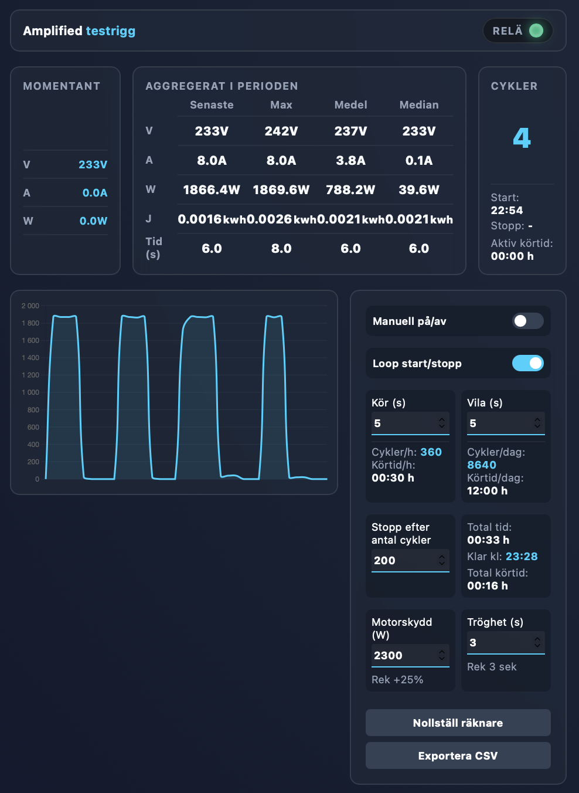
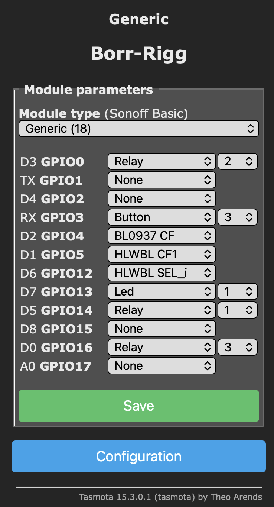

# Amplified Test Rig (Tasmota Smart Plug Mod)



## 1. Purpose and Modification
The **Amplified Test Rig** is a custom hardware and software solution designed to turn a standard Tasmota-flashed smart plug into an automated, cycle counter and test rig. It is specifically built for stress-testing power tools (e.g., drills). 

By monitoring real-time power consumption (Watts), the modified smart plug can accurately count active work cycles, filter out sensor reading lag, and protect connected machinery from overloading. It features an automated loop mode for continuous testing and an interactive Web UI for real-time telemetry, data aggregation, and hardware control.

## 2. Hardware & Firmware Requirements
This project requires a smart plug with built-in power monitoring capabilities (e.g., using BL0937, HLW8012, or CSE7766 chips). Standard non-monitoring plugs will not work.

**Tested Configuration:**
* **Microcontroller (MCU):** ESP8285H16 (2MB Flash)
* **Firmware:** Tasmota v15.3.0.1 (Core 2.7.8)
* **Network Mode:** Wi-Fi 11n (Ensure `WifiConfig 2` is set so it falls back to a hotspot if the network drops).

## 3. Tasmota Configuration
To make the smart plug function autonomously and safely (even if the network connection drops), you need to configure its internal logic via the Tasmota Web UI and Console.

### Module Configuration (Virtual Relays)
Out of the box, a smart plug only has one physical relay (`Power1`). To make our automated loop and reset functions work without an external server, we need to assign unused GPIO pins to create two additional "virtual" relays.



1. Open the Tasmota Web UI and go to **Configuration** -> **Configure Module** (or **Configure Template**).
2. Look for two **unused GPIO pins** (e.g., GPIO4, GPIO5, or others depending on your specific plug).
3. Assign the first unused GPIO to `Relay` with the number `2`. (This becomes `Power2` - our internal Reset trigger).
4. Assign the second unused GPIO to `Relay` with the number `3`. (This becomes `Power3` - our internal Loop trigger).
5. Click **Save** and let the device reboot.

*Optional: Rename the buttons via the Console for a cleaner UI:*
```text
Backlog WebButton1 Drill Power; WebButton2 RESET COUNTERS; WebButton3 LOOP MODE
```


### Console Rules Configuration
Paste the following rules one by one into the Tasmota Console. These rules handle the automated loop, the cycle counter, and the motor protection logic.

**Rule 1: The Automation Loop**
Handles the automatic ON/OFF cycles based on user-defined timers.
```text
Rule1 ON Power3#state=1 DO Backlog Power1 1;RuleTimer1 %mem1% ENDON ON Rules#Timer=1 DO Backlog Power1 0;RuleTimer2 %mem2% ENDON ON Rules#Timer=2 DO Backlog Power1 1;RuleTimer1 %mem1% ENDON ON Power3#state=0 DO Backlog RuleTimer1 0;RuleTimer2 0;Power1 0;Var4 0 ENDON
```

**Rule 2: Cycle Counter & System Safety**
Safely resets counters, handles reboots, and counts work cycles flawlessly by bypassing internal sensor lag.
```text
Rule2 ON Power2#state=1 DO Backlog Var1 0; Var2 0; EnergyReset1 0; EnergyReset2 0; EnergyReset3 0; Power2 0 ENDON ON System#Boot DO Backlog Var4 0; Power3 0 ENDON ON Energy#Power>10 DO IF (Var4==0) Backlog Var4 1;Add1 1 ENDIF ENDON ON Energy#Power<5 DO Var4 0 ENDON ON Energy#Power>0 DO IF (%value%>%var2%) Var2 %value% ENDIF ENDON
```

**Rule 3: Motor Protection (Overload Safety)**
*(Note: This rule is dynamically rewritten by the Web UI when you change the protection limit, but this is the default baseline).*
```text
Rule3 ON Energy#Power>1000 DO RuleTimer3 %mem4% ENDON ON Energy#Power<=1000 DO RuleTimer3 0 ENDON ON Rules#Timer=3 DO Backlog Power3 0; Power1 0 ENDON
```

### Rule Activation & Initial Variables
Run the following command to activate the rules in their strictly required modes. 
*Note: Rule 1 must run in Normal mode (`4`), while Rule 2 and 3 must run in Once mode (`5`) to prevent race conditions during cycle counting.*
```text
Backlog Rule1 4; Rule2 5; Rule3 5; Mem1 10; Mem2 2; Mem3 1000; Mem4 1; Var4 0
```

### 3.4 Power Monitoring Calibration
For the cycle counter and motor protection to work accurately, the smart plug's power monitoring chip must be calibrated. Standard smart plugs often have a 10-20% margin of error out of the box.

**Steps to calibrate:**
1. Connect a **known resistive load** to the smart plug (e.g., a classic 60W light bulb or a space heater with a verified rating). Do not use LED bulbs or inductive loads like drills for calibration.
2. Turn the load ON and wait for the power readings to stabilize.
3. Open the **Tasmota Console** and run the following commands based on your reference values:

* **Adjust Voltage:** `VoltageSet <volts>` (e.g., `VoltageSet 230`)
* **Adjust Power (Watts):** `PowerSet <watts>` (e.g., `PowerSet 60`)
* **Adjust Current (Amps):** `CurrentSet <milliAmps>` (e.g., `CurrentSet 260`)

Once calibrated, Tasmota will store these offsets in its flash memory.

## 4. Web UI Features (`start.html`)
The included `start.html` file serves as a modern, responsive control panel that communicates locally with the Tasmota API. 

**Key Features:**
* **Real-time Telemetry:** Live monitoring of Voltage (V), Current (A), and Power (W).
* **Aggregated Statistics:** Tracks Peak, Average, and Median values for the active test session, alongside total Energy (Joules/kWh).
* **Automated Loop Control:** Set custom "Run" and "Rest" intervals (in seconds). The UI calculates estimated cycles per hour/day and ETA if a hard limit is set.
* **Dynamic Motor Protection:** Instantly update the Wattage limit and delay tolerance. The Web UI safely compiles and injects the new safety constraints directly into Tasmota's `Rule3`.
* **Live Charting:** Visualizes power consumption over time using Chart.js.
* **Data Export:** Export the complete test run as a `.csv` file for external analysis.
* **Smart Polling:** Adapts the API polling rate based on the smart plug's CPU load to prevent crashes during intense data fetching.

## 5. Installation & Firmware Updates
The repository includes a custom firmware build (`firmwareXX.bin.gz`) based on **Tasmota 15.3**. This version has been configured to embed and serve the `start.html` dashboard directly from the device's internal file system.

* **Access:** Once flashed, the dashboard is accessible at `http://<device-ip>/start.html`.
* **Features:** The firmware retains standard Tasmota functionality (based on the stock 15.3 release) but is optimized to handle the local web server requirements.

### Flash Instructions
Due to the size of the custom firmware (containing the embedded UI), you must often follow the standard Tasmota two-step upgrade process:

1. **Flash Minimal:** First, upload `tasmota-minimal.bin.gz` via the Tasmota Web UI (Firmware Upgrade). This clears enough space in the memory for the new version.
2. **Flash Custom:** As soon as the device reboots in minimal mode, upload the full `firmwareXX.bin.gz` file.
3. **Update UI:** If you only need to update the `start.html` file without changing the core firmware, you can do so via the Tasmota **Manage File System** menu (if available) or by compiling a new firmware binary with the updated source.

## 6. Known Limitations & Future Improvements
* **Language:** Currently, the `start.html` dashboard is available only in Swedish.
* **Sampling Rate:** Telemetry values (V, A, W) are updated once per second (1 Hz). This limit is intentional to prevent overstressing the Tasmota smart plug's CPU with excessive network requests.
* **Manual Mode Tracking:** Currently, detailed cycle-time statistics are calculated by the Web UI. A future improvement would be to implement local time-tracking on the Tasmota plug itself (using native variables and rules). This would allow the Web UI to ingest pre-calculated duration data, ensuring 100% accurate statistics even for manually triggered cycles where the Web UI might not be open.


